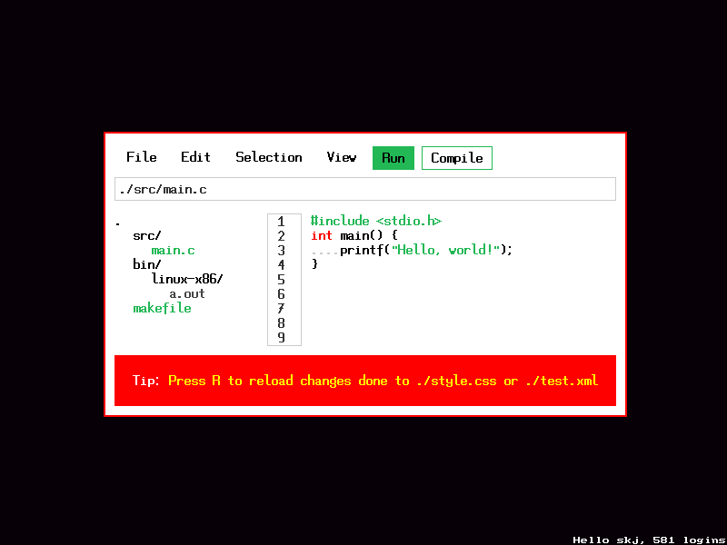

## Domlet

Dom-like system.

Here's the generated output from `test.xml` and `style.css`:


### Installation

To install, you need rust toolchain, for more information refer to https://rustup.rs/

For build to succeed you need to have SDL2 in your computer

To run the project do

```
cargo run
```

After it ran, it may crash or inform you that a certain file does not exist.

To fix that copy following files **into the same directory you run the executable**:

- config.ron
- font.bmp
- savedata.ron
- style.css
- test.xml

After that you should be able to run the project if afromentioned files are valid (note that for ./style.css and ./test.xml will not crash but inform you, you can still reload these using button "R" while the program is running, which will result in an immediate change, informing another error or showing the desired result.

### Usage

This project is mostly in a prototype stage, however interaction still exists.

To use this project install / run it following instructions previously. 

Edit ./test.xml
```
Div -> Regular block container
Span -> Inline container
```

for ./style.css it follows the same syntax as CSS, but there's no yet matching against parent,
you can't say
```
#main .file
```
And expect it to match all elements with class `file` within id `main`, instead it will match all elements with id `main` and class `file`

This is to be worked on

Another difference is rule "stretch", it defines on whether the elements with `display: block` will be stretched or not. Default value for block elements is `yes/true`

> **Note**: Inline styles are currently disabled!

